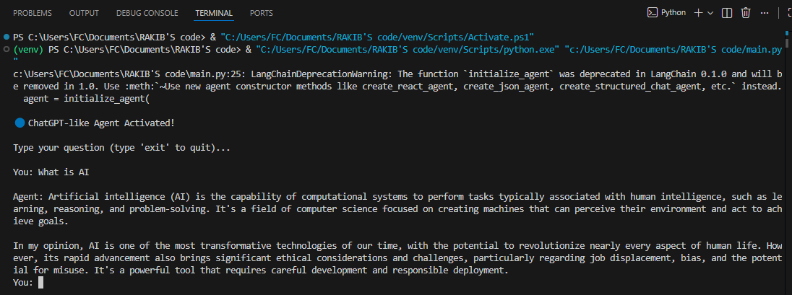

##🌟 AI Agent Project

A clean, modular, and production-ready AI Agent System powered by Google Gemini, LangChain, and custom-built research tools.
This agent can search the web, fetch Wikipedia data, save outputs, and provide intelligent conversational responses—similar to a lightweight ChatGPT.

##✨ Key Highlights
🚀 Google Gemini (gemini-2.5-flash)–powered LLM
🔎 DuckDuckGo & Wikipedia integrated research tools
💾 Auto-save outputs to a text file
🧠 REACT-style reasoning with LangChain
🔐 Secured API key handling using .env

🧩 Cleanly separated modules (main, tools, agent initializer)

##📂 Project Structure

AI Agent Project/
│── README.md
│── main.py                # Interactive CLI agent, LLM, tools, and agent setup
│── tools.py               # Search, Wiki & Save tools
│── research_output.txt    # Auto-generated output log
│── requirements.txt
└── .env                   # Gnvironment config

##🧠 How the Agent Works
🔹 1) Loads settings from .env
Loads your GEMINI_API_KEY securely.
🔹 2) Initializes the Gemini LLM
Using:
ChatGoogleGenerativeAI(model="gemini-2.5-flash", temperature=0.2)
🔹 3) Loads custom tools
DuckDuckGo Search
Wikipedia Summary
Save-to-file tool
🔹 4) Creates a REACT-based agent
The agent can:
Think
Search
Read Wikipedia
Save research
Give short answers + opinions

##⚙️ Installation & Setup
1️⃣ Clone Repository
git clone https://github.com/<your-username>/AI-Course
cd AI-Course/AI Agent Project

2️⃣ Create Virtual Environment
python -m venv venv
venv\Scripts\activate      # Windows
source venv/bin/activate   # Mac/Linux

3️⃣ Install Dependencies
pip install -r requirements.txt

4️⃣ Create .env File
GEMINI_API_KEY="your_api_key_here"

▶️ Run the Agent
Simply run:
python main.py

You will see:
🔵 ChatGPT-like Agent Activated!
Type your question (type 'exit' to quit)...

Then type:
You: What is AI?

It will search → reason → answer.

##📸 Screenshot
Paste this markdown after uploading your screenshot to an images/ folder:

##📦 Requirements
langchain==0.3.0
langchain-community==0.3.0
langchain-google-genai==2.0.0
google-ai-generativelanguage==0.7.0
python-dotenv==1.0.1
duckduckgo-search==5.2.2
wikipedia==1.4.0

##🚀 Future Enhancements
Memory-enabled long-term agent
Vector DB (FAISS/Chroma) integration
Web UI with Streamlit
Automated research agent
Logging & analytics

##👨‍💻 Author
Md. Rakib Ahmed
